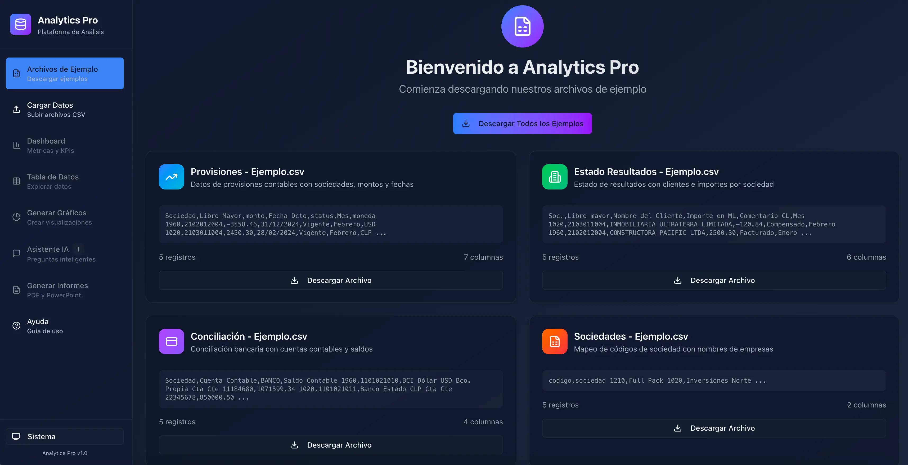

# Book Data Analizer

Dashboard web para subir **CSV**, unificar datos por **Sociedad**, explorar con **widget** (KPI, líneas, barra, pastel, heatmap, tabla), **arrastrar y redimensionar** widgets,**filtrar por sociedades** desde el el menu de seleccion, **exportar**(PDF y PPT), y consultar un **Asistente IA**(vía backend en Vercel con OpenAI). De forma local mostrara un resumen de los datos.

> Frontend: GitHub Pages (`https://reikem.github.io/book-data-analizer`)  
> Backend (serverless): Vercel (`https://book-data-analizer-api.vercel.app`)

---

## ✨ Características
## ✨ Características

- Carga múltiple de CSV y **unificación sin duplicados** (por `SociedadNombre` / `SociedadCodigo`).
- **Selector de sociedades** en el sidebar (persistente).  
- **Dashboard** con widgets reordenables y **redimensionables** (drag & resize).
- **Agregar/Quitar** widgets con confirmación; los nuevos **no reemplazan** los existentes.
- **Exportación** del dashboard (PDF/PPT) respetando el tema y sin cortes de gráficos.
- **Tabla** sin `SociedadCodigo` (muestra `SociedadNombre`).
- **Asistente IA**: intenta remoto (Vercel → OpenAI/DeepSeek) y si falla, **resumen local**.
- **GH Pages + HashRouter** para SPA estática.
- **CORS** configurado para `https://reikem.github.io`.

---

## 📦 Requisitos

- Node.js 18+ (recomendado 20 LTS)
- pnpm o npm
- (Opcional) Cuenta en OpenAI o DeepSeek para el backend

---

## 🚀 Puesta en marcha (Local)

```bash
# 1) Instalar dependencias
pnpm install
# o
npm install

# 2) Ejecutar frontend (Vite)
pnpm dev
# o
npm run dev
```

El frontend se sirve en `http://localhost:5173`.

Si también deseas probar un backend local Express/tsx (opcional):
```bash
pnpm dev:server
# o
npm run dev:server
```
> Asegúrate de tener `OPENAI_API_KEY` o `DEEPSEEK_API_KEY` en tu entorno local.

---

## 🌐 Despliegue

### 1) Frontend en GitHub Pages

- Configura Pages en el repo: **Settings → Pages → Source: GitHub Actions**.
- Asegúrate de usar `HashRouter` en React (ya incluido).
- **Variable de entorno** en GH Pages (opcional pero recomendado):  
  - `VITE_API_URL=https://book-data-analizer-api.vercel.app`

> La app consume esa URL para `/api/ping` y `/api/ask`.

### 2) Backend en Vercel

**Estructura mínima** (serverless functions):
```
/api
  ping.ts
  ask.ts
```


**Variables de entorno en Vercel → Settings → Environment Variables:**
- Si usas OpenAI:
  - `OPENAI_API_KEY=sk-...`
  - (opcional) `OPENAI_MODEL=gpt-4o-mini`
- Si usas DeepSeek:
  - `DEEPSEEK_API_KEY=sk-...`
  - (opcional) `DEEPSEEK_MODEL=deepseek-chat`

> Tras cambiar variables, **Redeploy** el proyecto en Vercel.

---

## 🔌 Integración Frontend ↔ Backend

En el frontend, la URL del backend se toma de `VITE_API_URL`:
```ts
// src/lib/chatUtils.ts (ejemplo)
export const API_BASE =
  import.meta.env.VITE_API_URL ?? "https://book-data-analizer-api.vercel.app"
```

**Endpoints usados:**
- `GET  /api/ping` → healthcheck (CORS OK)
- `POST /api/ask`  → pregunta al LLM

**Ejemplos `curl`:**

```bash
# Ping
curl -i "https://book-data-analizer-api.vercel.app/api/ping"

# Preguntar
curl -i -X POST "https://book-data-analizer-api.vercel.app/api/ask" \
  -H "Content-Type: application/json" \
  -d '{
    "question":"¿Cuáles son las 3 mejores acciones para mejorar margen?",
    "companies":["Full Pack - 1210"],
    "data":[
      { "SociedadNombre":"Full Pack", "SociedadCodigo":"1210", "Monto":1200, "Mes":"Enero" },
      { "SociedadNombre":"Full Pack", "SociedadCodigo":"1210", "Monto": 800, "Mes":"Febrero" }
    ]
  }'
```

---

## ⚙️ Variables de entorno (Frontend)

- `VITE_API_URL=https://book-data-analizer-api.vercel.app`  
  (Configurar en GitHub Pages → _Repository Settings_ → _Secrets and variables → Actions → Variables_).

---

## 🧰 Scripts comunes

```jsonc
// package.json (ejemplo)
{
  "scripts": {
    "dev": "vite",
    "build": "vite build",
    "preview": "vite preview",
    "lint": "eslint .",
    "format": "prettier --write ."
  }
}
```

---

## 🐞 Troubleshooting

- **401 Unauthorized / Invalid API Key**  
  Revisa `OPENAI_API_KEY` o `DEEPSEEK_API_KEY` en Vercel y redeploy.

- **429 Too Many Requests / Quota**  
  Has consumido el plan. Cambia a DeepSeek o actualiza plan.

- **CORS bloqueado**  
  Verifica que el backend devuelva `Access-Control-Allow-Origin: https://reikem.github.io` en ping/ask.

- **Gráficos recortados al exportar**  
  Usa `html2canvas` con `backgroundColor: "white", scale: 2` (ya incluido). Evita colores `oklab` no soportados.

- **GH Pages 404 al desplegar**  
  Asegura HashRouter y GitHub Actions habilitado en Settings → Pages.

---

## 📄 Licencia

MIT © 2025 reikem
